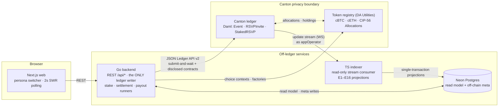
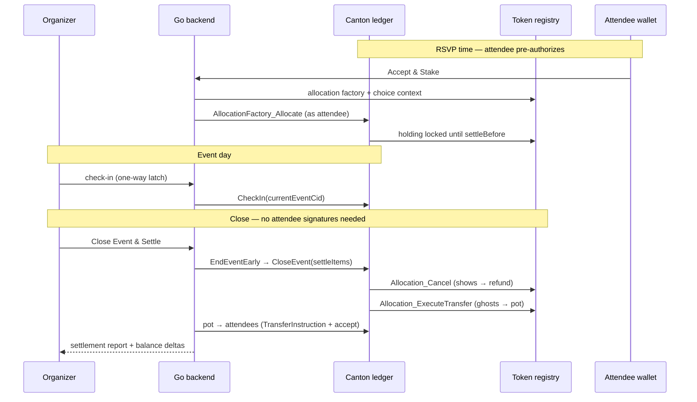

<p align="center">
  
</p>

<h1 align="center">ShowOrSow</h1>

<p align="center"><b>Privacy-preserving escrow for real-world event commitments on Canton.</b><br>
Stake to RSVP. Show up and get it back. Ghosts fund the people who came.</p>

> The logo is the pitch: your stake is a **seed**, planted below the ticket's perforation line the moment you RSVP. Show up — you harvest it back, plus a share of the pot. Ghost — your seed still grows, **but the people who came harvest it.**

    

> Built for **HackCanton Season 2** · Track: **RWA & Business Workflows** · Challenges: **cBTC (BitSafe)** + **cETH (OnRails)**

---

## The problem

Free events lose **40–70% of RSVPs to no-shows**. Organizers burn thousands of dollars guessing headcounts — wasted catering, empty venues, unused merch. Stake-to-attend was proven on public chains years ago (90%+ turnout), but it never scaled for one reason: **nobody wants their wallet balance permanently linked to their physical location on a transparent ledger.**

## The solution

ShowOrSow puts the stake mechanic on **Canton**, where privacy isn't a feature we built — it's the ledger model:

1. **Organizer** creates an event with a stake amount in any CIP-56 token (cBTC, cETH, …).
2. **Attendee** RSVPs by allocating the stake — funds lock **registry-side**; the app never takes custody.
3. Organizer **checks attendees in** at the venue.
4. On close, one settlement **refunds** everyone who showed up and **slashes** the ghosts — the forfeited pot is redistributed to the attendees who came. **Nobody signs anything at settle time**: attendees pre-authorize at RSVP.

And the privacy part: an attendee is **structurally incapable** of seeing another attendee's RSVP, stake, or identity. Not a UI filter, not an access rule we wrote — Canton's informee rules make the data physically absent from their node. Even our own indexer only sees what its party is entitled to see.

## How the escrow actually works (the interesting bit)

A third-party app **cannot lock or seize** someone's token holding on Canton — `Holding.lock` is registry-controlled. ShowOrSow uses the token standard's intended primitive instead, the **CIP-56 Allocation API**:

- Each RSVP is a `StakedRSVP` contract signed by **attendee + organizer + appOperator** that implements the standard `AllocationRequest` interface (one transfer leg: attendee → pot, fixed at RSVP time).
- The attendee allocates their holding against it (`AllocationFactory_Allocate` with a registry-fetched choice context) — the registry locks the funds until `settleBefore`.
- At settlement, `Settle` exercises `Allocation_Cancel` (refund) or `Allocation_ExecuteTransfer` (slash). Those choices require **executor + sender + receiver** authority — which is exactly the signatory set of `StakedRSVP`, so Daml's authority propagation lets the app settle **without any attendee interaction**. (Pattern cloned from Splice's reference `OTCTrade` app.)
- If the app ever dies, `settleBefore` expiry lets attendees recover their funds registry-side. Escrow with a built-in dead-man's switch.

Everything is written against the **generic CIP-56 interfaces** — the stake token is a config pair `(adminParty, instrumentId)`. The same code runs cBTC, cETH, or any compliant token.

## Architecture



**Design doctrine** (each rule closes a real failure mode):

| Rule | Why |
|---|---|
| Backend is the **only** ledger writer; browser never touches the ledger | JWTs stay server-side; one place to reason about authorization |
| Indexer is **read-only** and projects the stream into Postgres | If it dies, the on-chain flow keeps working — dashboards just go stale |
| Ledger is the sole source of truth for money; DB is a **rebuildable read model** | Refund-vs-slash is decided *inside the Daml choice*, never in backend code |
| One writer per DB table (indexer: projections · backend: `event_meta`, `balance_snapshots`) | No write races, replay-safe from offset 0 |
| Token facts (`decimals`, ids) are **read live from the registry** | Never bake token assumptions into code or DDL |

### Settlement sequence



### Privacy model (who sees what)

| Party | Sees |
|---|---|
| Attendee | Their own invite, their own RSVP, their own payout. **Nothing about other attendees — no names, no count, no TVL.** |
| Organizer | Headcount, TVL, check-in list (identities needed for the door) |
| appOperator (app party) | Everything it co-signed — which is the app's own workflow, not attendees' other holdings |
| Everyone else on Canton | Nothing. The contracts don't exist on their nodes. |

The test suite proves the core claim without any network: `dpm test` runs privacy assertions (`query` as attendee2 returns only their own contracts; unauthorized `CheckIn` fails).

## Monorepo layout

```
daml/         Smart contracts — module ShowOrSow (Event, RSVPInvite, StakedRSVP
              implementing the CIP-56 AllocationRequest interface)
daml-test/    Test-only package — MockRegistry + DemoScript test suite
              (happy path, privacy assertions, deadlines, validation edges)
backend/      Go — REST API (13 endpoints), stake/settlement/payout runners,
              withdrawal watcher, JSON Ledger API v2 + registry OpenAPI clients
indexer/      TypeScript — ledger update stream → Postgres projections (E1–E16),
              exactly-once (offset + batch in one transaction), poll fallback
web/          Next.js 15 — role-adaptive event page (organizer check-in/settle vs
              attendee stake state machine), persona switcher, settlement results
scripts/      fetch-dars.ps1 (token-standard DARs) · seed-event.ps1 (demo seed)
```

## Getting started

**Prerequisites:** Go ≥ 1.25 · Node ≥ 22 + pnpm · PostgreSQL (Neon or local) · [Daml SDK / dpm](https://docs.digitalasset.com) 3.4.x for the contracts · Docker (optional, for a local Canton LocalNet).

```bash
# 0. Configure
cp .env.example .env        # fill: ledger URL, DB URL, party ids, token config

# 1. Contracts
pwsh scripts/fetch-dars.ps1 # fetch the six splice token-standard DARs into daml/lib/
cd daml && dpm build        # compile
cd ../daml-test && dpm test # full suite incl. privacy assertions — no network needed

# 2. Database
cd ../indexer && pnpm install && pnpm migrate

# 3. Run (three processes)
cd backend && go run ./cmd/server     # :8080
cd indexer && pnpm dev                # healthz :8091
cd web     && pnpm install && pnpm dev  # :3000
```

Local ledger options: `dpm sandbox --dar daml/.daml/dist/showorsow-*.dar --json-api-port 7575 --static-time` for the fast loop, or a Splice LocalNet (via [canton-devkit](https://github.com/bitdynamics-ab/canton-devkit) / the official docker-compose) when you want a real token registry. On Canton DevNet, cBTC test funds come from the [BitSafe faucet](https://cbtc-faucet.bitsafe.finance/) (transfers arrive as offers — accept them).

## Demo narrative

One event, 0.01 cBTC stake, three attendees. Alice and Bob check in; Charlie ghosts. **Close Event** → Alice **+0.005**, Bob **+0.005**, Charlie **−0.01** — refunds via `Allocation_Cancel`, the slash via `Allocation_ExecuteTransfer`, pot redistributed, all identities mutually invisible throughout. Side-by-side sessions show the organizer's full dashboard next to Bob's view, which contains *only Bob*.

## What's real / what's simulated / known limitations

Honesty section — judges deserve the truth:

- **Real:** every ledger action — contract creation, allocation locking, check-in, settlement, redistribution — executes on a Canton ledger via the JSON Ledger API v2 against real CIP-56 interfaces.
- **Simulated:** the venue (this is software — someone still has to stand at a door); the frontend plays the *wallet role* for allocations (wallet-side `AllocationRequest` rendering is still immature ecosystem-wide) — the demo says so on screen.
- **Known limitations:** attendees can `Allocation_Withdraw` pre-settlement (by standard design — we detect it and void the RSVP); wire shapes for the registry/ledger APIs are validated against docs and a sandbox, pending a full DevNet integration pass; auth is demo-grade persona sessions (deliberate — the identity model is Canton parties, not passwords).

## Hackathon fit

- **Track — RWA & Business Workflows:** a pilot-ready real-world workflow: issuance (stake) → state change (check-in) → transfer (settlement) → fulfillment (attendance) → audit (per-row ledger transaction ids in the UI).
- **cBTC Ecosystem Challenge:** "CBTC escrow" is a named lane in the brief — the token *moves, settles, locks, and powers the app logic* here, generating recurring on-chain activity per event.
- **cETH Ecosystem Challenge:** cETH drives real state changes — collateral in, conditional settlement out. Token-agnostic by construction: same code, config swap.

## License

[MIT](LICENSE) © 2026 ShowOrSow contributors
